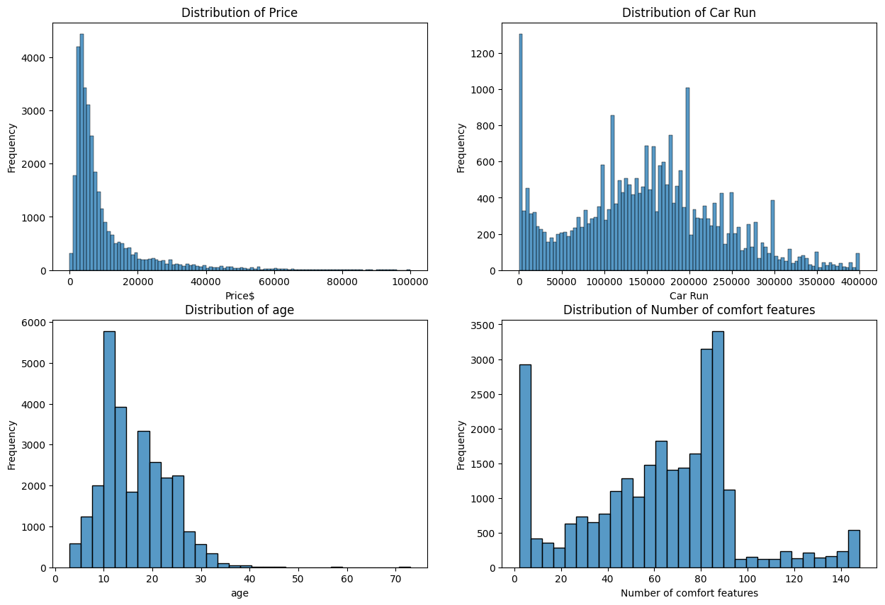
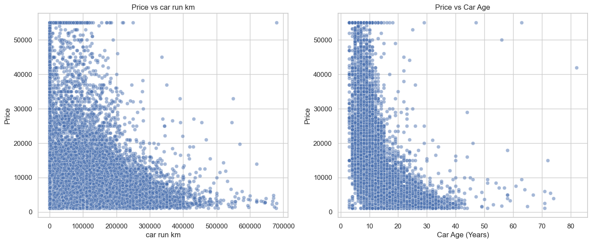
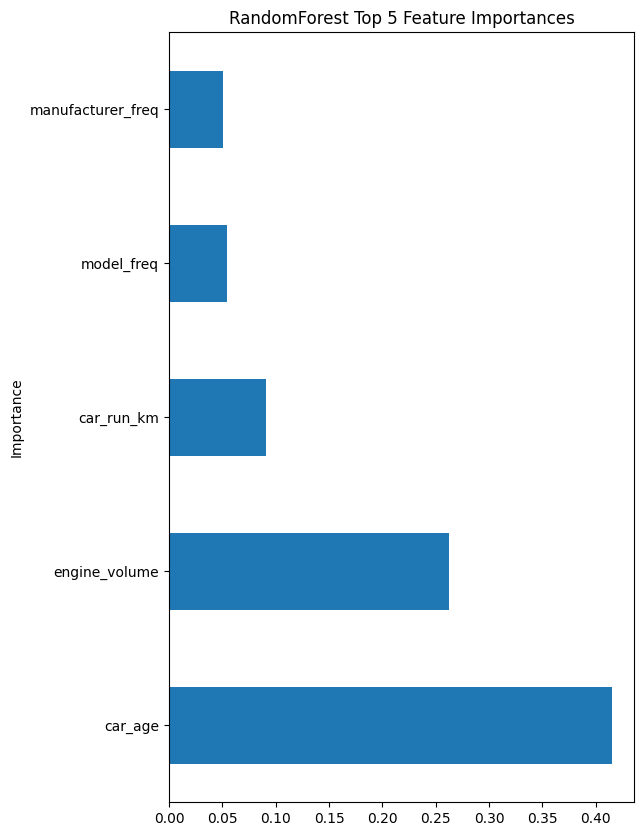
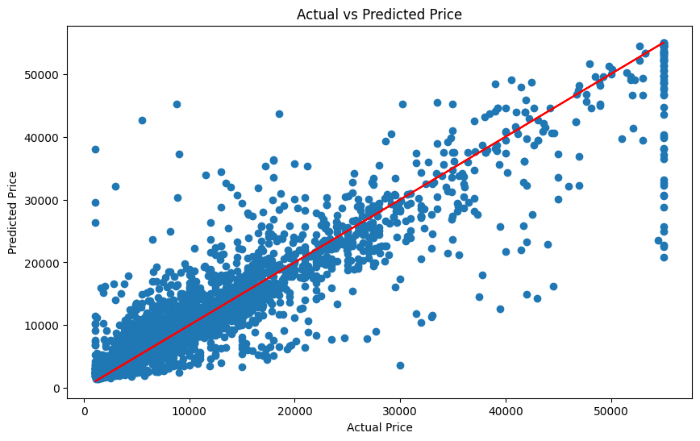
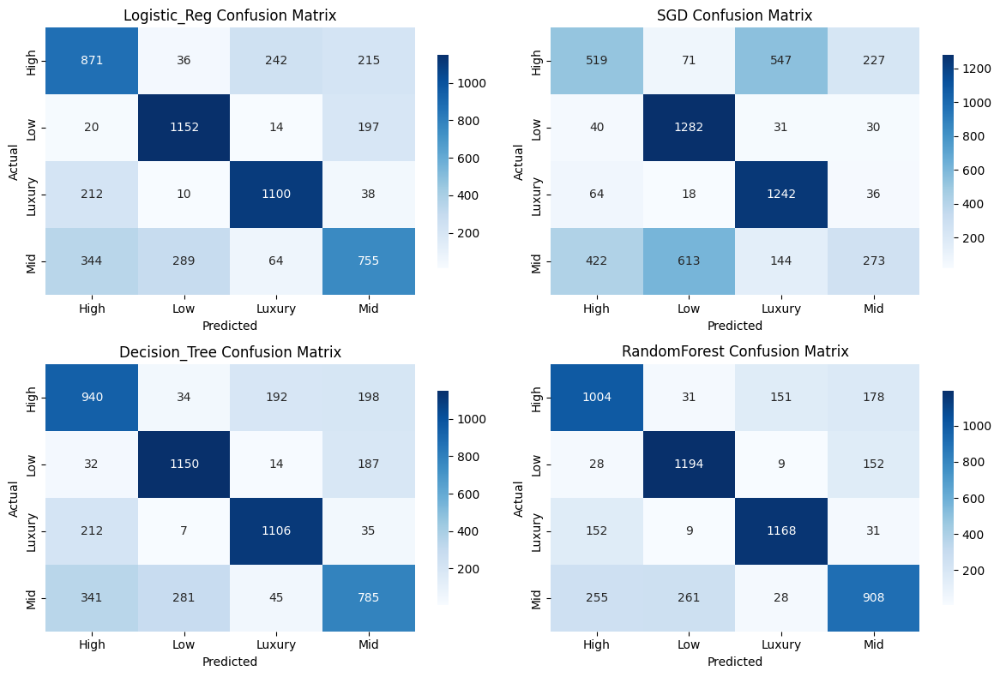

# Georgian Marketplace Car Data Analysis

## Data Science With Python Final Project

Team: 
Jaba Adamia
Jumber Phkhakadze

## Project overview

This project analyzes and models car listing data with the goal of estimating fair market prices for vehicles listed on Georgian marketplace. It contains data processing pipelines, exploratory notebooks, a Streamlit demo app for price prediction, and saved model artifacts used for inference.

### Problem statement

In many local car markets the advertised price does not always reflect a vehicle's condition, equipment, or market demand. This project builds an end-to-end pipeline to:

- Clean and transform raw listing data into analysis ready CSVs.
- Explore and visualize features that influence price.
- Train and persist machine learning models to estimate vehicle prices.
- Provide a simple user interface to get price estimates for a single car instance.

Objectives

- Produce a clean, reproducible dataset from raw listings.
- Engineer features that capture age, kilometrage, equipment and categorical encodings.
- Train interpretable models and package them for inference.
- Ship a lightweight Streamlit app so non technical users can try the estimator.

## Dataset

Files in this repository:

- `data/raw/cars_data.jl` — original raw JSON lines dump of listings (source noted below. Ignored by git, instead `cars_60k.csv` can be used).
- `data/processed/cars_60k.csv` — initial processed sample extracted from the JL file (roughly 60k rows, outputed by `script/produce_csv.py`).
- `data/processed/cars_clean.csv` — further cleaned CSV used for modeling.
- `id_mappings/` — mapping JSONs used to translate categorical id fields to human readable titles (taken from myauto API).

Source

The raw dataset was taken from: 
https://www.kaggle.com/code/tornikeonoprishvili/scraping-myauto-ge/output

Quick data description
- raw data had 118 columns most of which was dropped.
- Columns include: `prod_year`, `price`, `manufacturer`, `model`, `fuel_type`, `gear_type`, `drive_type`, `color`, `engine_volume`, `cylinders`, `car_run_km`, binary feature flags (ABS, airbags, conditioner, etc.), `customs_passed`, `tech_inspection`, and others. The exact column list is produced by `scripts/produce_csv.py` and final cleaned data features can be seen here: `notebooks/02_data_processing.ipynb`.

## Installation & setup

Requirements

- project was developed using Python 3.13+
- See `requirements.txt` for the Python packages used.

Install

1. Clone the repository and change into the project directory:

```bash
git clone https://github.com/jabaadamia/geo-car-data-analysis.git
cd geo-car-data-analysis
```

2. Create and activate a virtual environment (recommended):

```bash
python -m venv .venv
source .venv/bin/activate   # macOS
pip install --upgrade pip
```

3. Install dependencies:

```bash
pip install -r requirements.txt
```

## Prepare the data

If you have the raw `cars_data.jl` located at `data/raw/cars_data.jl`, use the helper script to convert it to a CSV. By default the script filters out vehicles located at USA, motorcylces and rental cars:

```bash
python scripts/produce_csv.py
```

This will create `data/processed/cars_60k.csv`.


Otherwise start from notebooks directly (must have `data/processed/cars_60k.csv`)

## Usage examples

Explore and reproduce results using the notebooks:

- `notebooks/01_data_exploration.ipynb` — initial data checks and summary statistics.
- `notebooks/02_data_processing.ipynb` — detailed cleaning and feature engineering steps. Produces `data/processed/cars_clean.csv`
- `notebooks/03_eda_visualizations.ipynb` — more plots and statistical insights from cleaned data.
- `notebooks/04_machine_learing.ipynb` — model training and evaluation. On clean dataset.

Before demo make sure to run everyting mentioned above and `scripts/setup_inference.py` (produces model artifacts)

Run the Streamlit demo (local):

```bash
streamlit run streamlit_app.py
```

The Streamlit app loads model artifacts and id mappings from the `models/` and `id_mappings/` folders and exposes a simple form to enter vehicle features and get a predicted price.

If you prefer to call the model from a script, you can run `scripts/test_model_results.py`, which runs model on sample cars from `id_mappings/test_cars.json` which has few recent cars from market (uncleaned, directly copied car detail response json).

<!-- ## Results summary

- Data: The pipeline produces a cleaned dataset of roughly 30k listings (after sampling/filtering) with ~30 selected columns used for modeling.
- Models: A Random Forest regressor was trained and saved to `models/random_forest_model.pkl`. The Streamlit app demonstrates using these saved artifacts to produce price estimates based on input specs. -->

## Project structure

- `data/` — raw and processed datasets
- `id_mappings/` — JSON mappings used for categorical conversion
- `models/` — saved model artifacts used by the app (ignored by git, produce by running `04_machine_learning.ipynb` and `setup_inference.py`)
- `notebooks/` — exploratory analysis and modeling notebooks
- `scripts/produce_csv.py` — converts raw JL to CSV and selects needed columns
- `streamlit_app.py` — demo web app for single car price prediction
- `src/` — helper modules for data processing

## Key Achievements
*   **Price Prediction:** Achieved a high **R² score of 0.86** using a Random Forest Regressor, with a Mean Absolute Error (MAE) of **~$1,720**.
*   **Price Class Classification:** Achieved **76.8% Accuracy** in classifying price categories (Low, Mid, High, Luxury) using Random Forest.
*   **Insight:** Non-linear models (Trees) significantly outperform linear baselines across both tasks.

---

## Key Insights from Data Analysis

##### price and other feature distributions in uncleaned data
##### 
*Description:* A plot showing distribution of several features including price. Indicating dataset is dominated by lower end cars.


### The Depreciation Curve
### 
*Description:* A plot showing price on the Y-axis and Age on the X-axis. It reveals a steep non-linear drop in value for the first 5 years, followed by a plateau. This curvature explains why linear models underperformed.

### Feature Importance Analysis
### 

---

### Price Prediction

We tested five distinct models to compare performance for predicting `price`.

#### Model Comparison Table
The table below details the metrics on the unseen test dataset.

| Model | R² Score | Mean Squared Error (MSE) | Mean Absolute Error (MAE) | RMSE |
| :--- | :--- | :--- | :--- | :--- |
| **Linear Regression** | 0.489 | 4.45e+07 | $4,251.83 | $6,670.13 |
| **Lasso** | 0.489 | 4.45e+07 | $4,250.19 | $6,669.83 |
| **Ridge** | 0.489 | 4.45e+07 | $4,251.71 | $6,670.10 |
| **Decision Tree** | 0.769 | 2.01e+07 | $2,190.79 | $4,482.29 |
| **Random Forest** | **0.858** | **1.24e+07** | **$1,720.64** | **$3,522.34** |

The **Random Forest Regressor** was selected as the production model due to its superior performance.


#### 
Above scatter plot illustrates comparison of predicted and actual price.

---

### Price Category Classification

In addition to price prediction, we trained models to classify the price category ('Low', 'Mid', 'High', 'Luxury') based on the same input features.

#### Classification Performance
| Model | Accuracy | Precision | Recall | F1 Score |
| :--- | :--- | :--- | :--- | :--- |
| Logistic Regression | 0.697607 | 0.694463 | 0.700083 | 0.695543 |
| SGD Classifier | 0.596510 | 0.564384 | 0.602180 | 0.552563 |
| Decision Tree | 0.716136 | 0.716032 | 0.718636 | 0.715343 |
| **Random Forest** | **0.768843** | **0.768312** | **0.770895** | **0.768402** |


#### 
A heatmap illustrating the classification performance. The diagonal is dense, indicating high accuracy.

**Conclusion:** Random Forest achieved the highest **Accuracy (76.8%)**, effectively handling the multi-class problem better than linear classifiers.

---

### Real World Validation Test

To validate the pricing model outside of standard cross-validation, we ran a specialized test script (`test_model_results.py`) on distinct samples.

#### Test Cases & Analysis

| | Manufacturer | Model | Age | Predicted Price | Actual Price | Error |
|---:|:---|:---|---:|---:|---:|---:|
| **0** | **Toyota** | **RAV 4** | 2 years | **$18,499.67** | $24,900 | ~$6,400 |
| **1** | **Mercedes-Benz** | **C 300** | 11 years | **$6,373.53** | $7,900 | ~$1,526 |
| **2** | **Opel** | **Zafira** | 23 years | **$3,252.64** | $3,000 | ~$252 |

#### Performance Analysis of Samples:
1.  The model under-predicted the newer RAV4.
2.  For the 11 year old Mercedes, the prediction was solid (~$1.5k off), correctly accounting for the luxury depreciation curve.
3. The prediction for the 23 year old Opel was highly accurate (error < $300), showing the model is better for older vehicles.

---

### Conclusions & Recommendations

* **Overall Conclusion:**  
  Tree based models, particularly Random Forest, consistently delivered the strongest performance across both tasks. Their ability to capture non linear relationships in depreciation, mileage, and equipment makes them well suited for real world vehicle pricing problems.

* **Practical Impact:**  
  An MAE of approximately **$1,720** indicates the regression model is accurate enough for automated price estimation, helping users and businesses quickly assess whether a listing is underpriced or overpriced before deeper inspection.

* **Recommendations for Improvement:**  
  * Apply **class balancing techniques** (e.g., class weights or resampling) to improve Recall in minority price categories, especially for Luxury listings.  
  * Expand validation with more recent market samples to better capture short term price fluctuations and demand shifts.
